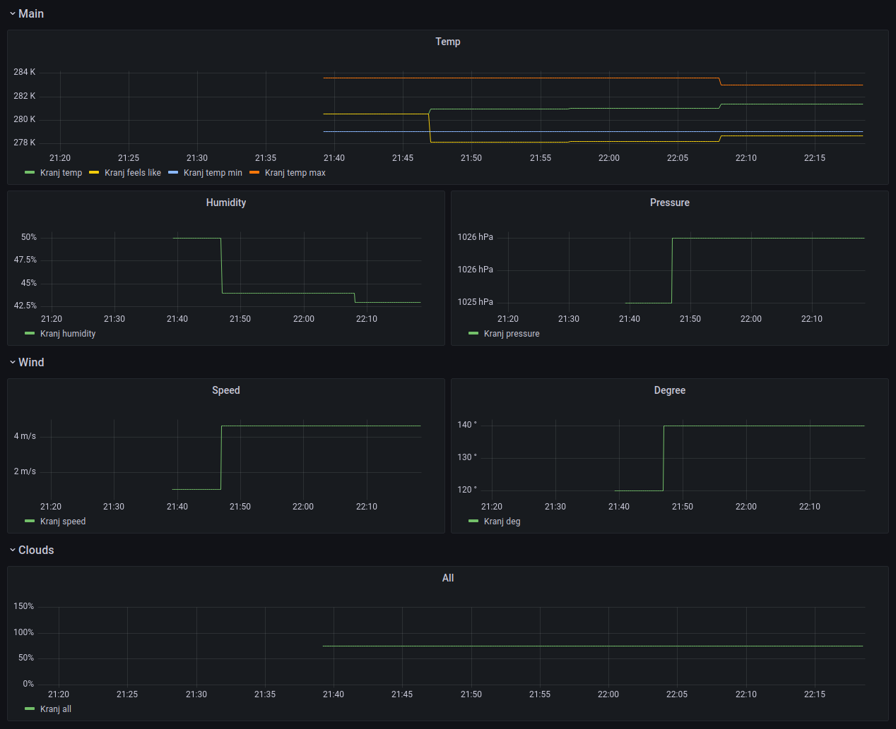

# Open Weather Prometheus Exporter

Export OpenWeather data into Prometheus.

Supported APIs:

- [Current weather data](https://openweathermap.org/current)



## Getting started

```sh
# Run exporter in Docker container with port forwarded to 1234.
docker run --rm -it -p 1234:80 ulexxander/open-weather-prometheus-exporter -app-id=<YOUR_APP_ID> -coords='[{"lat":46.2389,"lon":14.3556}]'

# Fetch exported metrics.
curl localhost:1234
# Output:
# open_weather_clouds_all{id="3197378",name="Kranj"} 75
# open_weather_main_feels_like{id="3197378",name="Kranj"} 279
# open_weather_main_humidity{id="3197378",name="Kranj"} 42
# open_weather_main_pressure{id="3197378",name="Kranj"} 1026
# open_weather_main_temp{id="3197378",name="Kranj"} 281.45
# open_weather_main_temp_max{id="3197378",name="Kranj"} 282.92
# open_weather_main_temp_min{id="3197378",name="Kranj"} 279.04
# open_weather_wind_deg{id="3197378",name="Kranj"} 130
# open_weather_wind_speed{id="3197378",name="Kranj"} 4.12
```

Refer to [docker-compose.yml](./docker-compose.yml) and [prometheus.yml](./prometheus.yml) for setup with Grafana and Prometheus.

Import [grafana-dashboard.json](grafana-dashboard.json) into Grafana to get pre-built dashboard from the screenshot.
