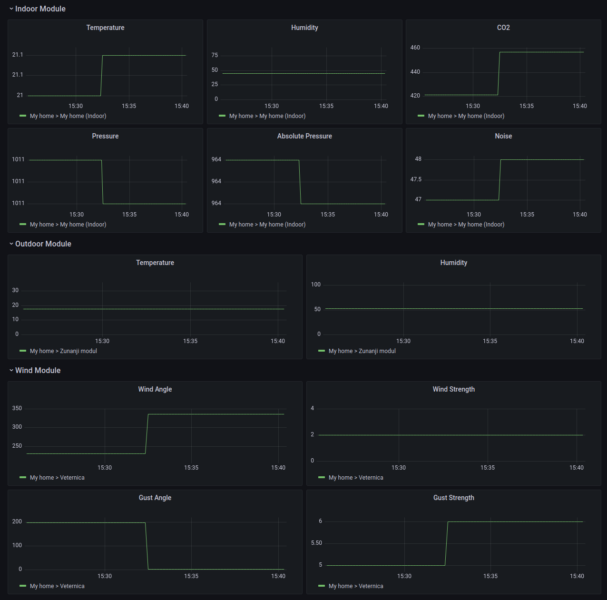

# Weather Prometheus Exporters

[Docker Hub](https://hub.docker.com/r/ulexxander/weather-prometheus-exporters)

Export OpenWeather and Netatmo weather data into Prometheus.

Supported APIs:

- [Netatmo Stations Data](https://dev.netatmo.com/apidocumentation/weather#getstationsdata)
- [OpenWeather Current Weather Data](https://openweathermap.org/current)

Netatmo Grafana dashboard:



OpenWeather Grafana dashboard:


## Getting started

```sh
# Create environment variables for storing credentials.
# See .example.env for OpenWeather and Netatmo required variables.
touch .env

# Run exporter in Docker container with config.json mounted and port forwarded to 4000.
docker run --rm -it -p 4000:80 --env-file=.env -v="${PWD}/config.json:/weather-prometheus-exporters/config.json" ulexxander/weather-prometheus-exporters

# Fetch exported metrics.
curl localhost:4000
# Output:
# netatmo_indoor_module_absolute_pressure{home_id="61b646afb535277ce721d1a4",home_name="My home",id="70:ee:50:80:26:fa",station_name="My home (Indoor)",type="NAMain"} 964.4
# netatmo_indoor_module_co2{home_id="61b646afb535277ce721d1a4",home_name="My home",id="70:ee:50:80:26:fa",station_name="My home (Indoor)",type="NAMain"} 418
# netatmo_indoor_module_humidity{home_id="61b646afb535277ce721d1a4",home_name="My home",id="70:ee:50:80:26:fa",station_name="My home (Indoor)",type="NAMain"} 45
# netatmo_indoor_module_noise{home_id="61b646afb535277ce721d1a4",home_name="My home",id="70:ee:50:80:26:fa",station_name="My home (Indoor)",type="NAMain"} 43
# netatmo_indoor_module_pressure{home_id="61b646afb535277ce721d1a4",home_name="My home",id="70:ee:50:80:26:fa",station_name="My home (Indoor)",type="NAMain"} 1010.8
# netatmo_indoor_module_temperature{home_id="61b646afb535277ce721d1a4",home_name="My home",id="70:ee:50:80:26:fa",station_name="My home (Indoor)",type="NAMain"} 20.7
# netatmo_outdoor_module_humidity{home_id="61b646afb535277ce721d1a4",home_name="My home",id="02:00:00:7f:e6:96",module_name="Zunanji modul",type="NAModule1"} 55
# netatmo_outdoor_module_temperature{home_id="61b646afb535277ce721d1a4",home_name="My home",id="02:00:00:7f:e6:96",module_name="Zunanji modul",type="NAModule1"} 17.4
# netatmo_wind_module_gust_angle{home_id="61b646afb535277ce721d1a4",home_name="My home",id="06:00:00:05:c6:48",module_name="Veternica",type="NAModule2"} 0
# netatmo_wind_module_gust_strength{home_id="61b646afb535277ce721d1a4",home_name="My home",id="06:00:00:05:c6:48",module_name="Veternica",type="NAModule2"} 6
# netatmo_wind_module_wind_angle{home_id="61b646afb535277ce721d1a4",home_name="My home",id="06:00:00:05:c6:48",module_name="Veternica",type="NAModule2"} 296
# netatmo_wind_module_wind_strength{home_id="61b646afb535277ce721d1a4",home_name="My home",id="06:00:00:05:c6:48",module_name="Veternica",type="NAModule2"} 2
# open_weather_clouds_all{id="3196359",name="Ljubljana"} 75
# open_weather_main_feels_like{id="3196359",name="Ljubljana"} 290.62
# open_weather_main_humidity{id="3196359",name="Ljubljana"} 51
# open_weather_main_pressure{id="3196359",name="Ljubljana"} 1015
# open_weather_main_temp{id="3196359",name="Ljubljana"} 291.41
# open_weather_main_temp_max{id="3196359",name="Ljubljana"} 292.25
# open_weather_main_temp_min{id="3196359",name="Ljubljana"} 290.58
# open_weather_wind_deg{id="3196359",name="Ljubljana"} 80
# open_weather_wind_speed{id="3196359",name="Ljubljana"} 2.57
```

Refer to [docker-compose.yml](./docker-compose.yml) and [prometheus.yml](./prometheus.yml) for setup with Grafana and Prometheus.

Import [grafana-dashboard-netatmo.json](grafana-dashboard-netatmo.json) and [grafana-dashboard-open-weather.json](grafana-dashboard-open-weather.json) into Grafana to get pre-built dashboards from screenshots.

## Development

```sh
# Run tests.
go test -v ./...

# Run locally on port 4000.
# Load environment variables from .env file (optional).
go run ./main.go -addr=:4000 -env-file=.env
```
